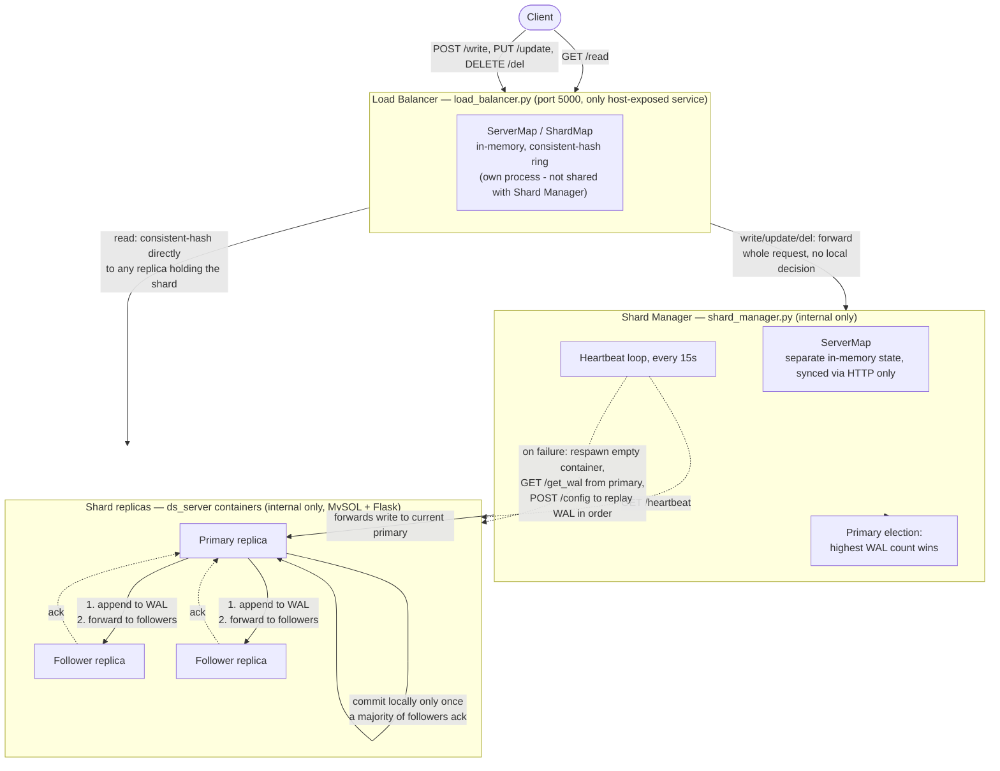

# Distributed Sharded Key-Value Store

A distributed key-value store that shards data across multiple database-backed servers, replicates each shard across replicas for fault tolerance, and load-balances requests using consistent hashing — plus a full DevOps layer (Terraform, Ansible, GitHub Actions CI/CD, Prometheus/Grafana) that provisions, configures, tests, and monitors it on real AWS infrastructure.

In plain terms: you tell it how many shards and replica servers you want, `POST` that config once, and from then on it behaves like one database — reads and writes get routed to the right shard/replica automatically, and if a replica crashes, another one takes over without you doing anything.

This is the active, consolidated project. Earlier coursework iterations (`Assignment1`, `Assignment2`, `Assignment3`) are preserved untouched under [`../legacy/`](../legacy/) for reference — this project started as a copy of `Assignment3`, the most complete of the three, and everything described below (architecture aside) was added on top of it.

## Architecture

The original coursework diagram (`legacy/Assignment3/images/system_diagram.png`) shows a bulk shard-copy recovery mechanism and a single shared metadata store between the load balancer and shard manager — neither matches what's actually implemented (recovery is WAL replay into a fresh container; the two services run as separate processes with independent, HTTP-synced state, not shared memory). The diagram below reflects the current code instead:



Three Flask services, all on a shared Docker bridge network (`pub`):

### Load balancer (`load_balancer.py`)

The single entry point (port 5000, the only service port-mapped to the host). Holds two in-memory singleton maps and routes every request through them:

- **`ServerMap`** — maps server IDs to `Server` objects, each of which knows which shards it holds and proxies CRUD calls (`insertData`, `getData`, `updateData`, `delData`) to that server's actual container over HTTP.
- **`ShardMap`** — maps shard IDs to `Shard` objects. Each `Shard` implements **consistent hashing**: a fixed-size ring (512 slots) with 9 virtual nodes per server, so a server's share of the ring is spread out rather than being one contiguous block — this keeps load reasonably even and means adding/removing a server only reshuffles a fraction of the ring, not all of it. `getLoadBalancedServerId` walks the ring from a request's hash to find the next occupied slot.
- **`MultiLockDict`** — a two-stage locking mechanism (see Design Choices below) used to serialize writes per shard.

`/init` spawns the server containers (via `docker.sock`, mounted into the load balancer container) and registers them in both maps; `/add`/`/rm` scale the cluster; `/read`, `/write`, `/update`, `/del` fan requests out across shards using the maps above; `/status` reports current topology. There is intentionally no `/` route and no host-reachable `/heartbeat` — both 404 by design (see Setup & Usage below).

### Shard manager (`shard_manager/shard_manager.py`)

Internal only — not port-mapped to the host, reachable only from inside `pub`. Tracks which servers hold which shards (`ShardManager` → `ServerMap` per shard, confusingly named the same as the load balancer's classes but a separate, simpler implementation) and runs a background thread every 15 seconds that:

1. Runs **primary election** per shard: pings the current primary's `/heartbeat`; if it's still alive, keeps it. Otherwise, queries every replica's `/get_wal_count` and promotes whichever has replayed the most write-ahead-log entries — i.e., whichever replica is most up to date wins leadership, not whichever was primary before.
2. Pings every server's `/heartbeat`. If one doesn't respond, respawns its container from a clean `ds_server:latest` image and replays the primary's WAL into it via `/get_wal`, bringing it back to a consistent state before it rejoins.

### Server (`server/server.py` + `manager.py` + `helper.py`)

One container per server instance, internal only. Built `FROM mysql:8.0-debian`; the Flask app is launched by `deploy.sh` via MySQL's `/always-initdb.d` init hook (see `server/Dockerfile`, `server/custom-entry.sh`) so the app only starts once MySQL itself is ready. Exposes CRUD (`/read`, `/write`, `/update`, `/del`), replication (`/get_wal`, `/get_wal_count`), `/config`, `/copy`, `/heartbeat`, and `/metrics`.

**Log replication**: every write-type request (`/write`, `/update`, `/del`) that reaches a server does the following, in order:
1. Appends the endpoint + payload to a per-shard write-ahead log file (`{shard}_logs`).
2. Forwards the same request to every follower for that shard.
3. Only commits to its own MySQL database once a **majority** of followers have acknowledged (or immediately if there are no followers).
4. Returns success/failure to the caller based on that majority.

If a server crashes and is respawned, its WAL is replayed in order against the fresh container, bringing it back to a consistent state — this is what `shard_manager.py`'s respawn logic and the primary-election WAL-count comparison both rely on.

### Storage abstraction layer (`server/helper.py`, `server/manager.py`)

Three layers, each with one job, so the actual storage engine (MySQL today) isn't wired directly into the Flask routes:

- **`SQLHandler`** — the only class that speaks raw SQL/`pymysql`. Owns the actual database connection and a single-threaded job runner (`multiprocessing.dummy.Pool(1)`) that all queries are funneled through, so concurrent requests to the same server don't race on the same connection.
- **`DataHandler`** — a generic CRUD interface (`Insert`, `InsertMany`, `GetAll`, `GetRange`, `Update`, `Delete`) built purely on top of `SQLHandler`'s methods, with no SQL of its own. This is the actual abstraction boundary: swapping MySQL for another engine (MariaDB, MongoDB, etc.) means writing a new handler with the same method names underneath `DataHandler` — nothing above this layer changes.
- **`Manager`** — the object `server.py`'s route handlers actually call (`manager.read(...)`, `manager.write(...)`, etc.). Thin wrapper that owns one `SQLHandler`/`DataHandler` pair per shard, keyed by `shard_id`.

## Design Choices

These are the actual reasons behind the non-obvious decisions in this codebase, carried forward from the original design (and still accurate to what's implemented):

**Why an in-memory load balancer, but persistent servers.** The load balancer's metadata (`ServerMap`, `ShardMap`, the consistent-hashing ring) is kept in plain Python dicts/lists, not a database, for three reasons: querying a database on every single request to figure out routing would be slower than an in-memory lookup; the hash ring itself is inherently an in-memory structure (there's no natural way to "query" your way through ring traversal); and the load balancer isn't expected to survive crashes gracefully — `/init` rebuilds all of this from scratch on startup, so there's nothing to gain from persisting it. The actual student data, by contrast, has to survive restarts and crashes, so it lives in MySQL, one database per shard per server (not one shared database with separate tables) — this uncouples shards from each other (a corrupt shard doesn't take down its siblings on the same server) and avoids MySQL connection-pool contention between shards that would happen if they shared one database.

**Why two-stage locking for writes.** Writes need mutual exclusion per shard (so two concurrent writes to the same shard don't interleave), but shard locks don't exist until the first time that shard is written to. `MultiLockDict` solves this with a lock protecting the *creation* of per-shard locks (a global lock, held only briefly to check-and-insert into the lock dictionary) plus the actual per-shard lock used for the write itself. This avoids a single global write lock (which would serialize writes across *all* shards, not just within one) while still being race-free about lazily creating each shard's lock.

**Why leader election by WAL count, not by uptime or server ID.** When a primary goes down, the replica that gets promoted is whichever one has the most write-ahead-log entries replayed — i.e., whichever is closest to what the dead primary actually had, not an arbitrary "first" or "oldest" replica. This directly minimizes data loss on failover: promoting a stale replica would silently drop whatever writes it missed.

## The DevOps Layer

Four tools, four distinct jobs — not a features list, an actual separation of concerns where each layer only does what the layer below it can't:

```
Terraform  →  provisions a bare, reachable machine (nothing else)
    ↓
Ansible    →  configures that machine: hardens it, installs Docker, deploys the app
    ↓
GitHub Actions → validates every push automatically, redeploys on demand
    ↓
Prometheus/Grafana → observes whatever's currently running
```

### Terraform (`terraform/`)

Provisions exactly one AWS EC2 instance, deliberately kept free-tier-safe by construction rather than by convention: `instance_type` is validated to only accept `t2.micro`/`t3.micro`, the root volume is capped at 20 GiB (well under the 30 GiB free allowance), and there's no `aws_eip` anywhere — the instance's auto-assigned public IP is covered by the Free Tier's public-IPv4 allowance instead. The security group opens exactly three ports: 22 (SSH, locked to a single CIDR), 5000 (the load balancer API), and 3000 (Grafana). A separate, narrowly-scoped IAM user (`ci_iam.tf`) exists solely so GitHub Actions can temporarily open/close SSH access for its own IP — see the CI/CD section below.

Deliberately **no `user_data`**. Terraform's job stops at "a reachable machine exists" — the Ubuntu AMI already boots with `sshd` running and the key installed, which is provably true (SSH works immediately after `apply`, before any configuration has happened). Installing Docker, hardening SSH, and deploying the app are configuration-management concerns and belong to Ansible.

### Ansible (`ansible/`)

Three roles, run in order against the instance Terraform just created:

1. **`hardening`** — patches the system, enables `unattended-upgrades`, disables SSH password auth and root login, and enables `ufw` as a second, OS-level firewall mirroring the security group (independent enforcement layers: one at AWS's network edge, one inside the kernel).
2. **`docker`** — installs Docker Engine + Compose v2 from Docker's own apt repository (not Ubuntu's bundled `docker.io`, which doesn't ship a `docker-compose-plugin` package at all), and adds the `ubuntu` user to the `docker` group — followed by a `meta: reset_connection` task, because Linux group membership only takes effect on a new login session.
3. **`deploy`** — clones/pulls the repo, generates a random Grafana admin password (cached locally so repeat runs against the same checkout reuse it rather than rotating it every time) and writes it to a gitignored `.env` file, runs `make all`, then polls `/status` until the stack actually answers — so a successful playbook run means "verified working," not just "commands executed."

The instance's IP changes every time Terraform recreates it, so the inventory (`inventory/hosts.ini`) is never committed — `update_inventory.sh` regenerates it from `terraform output` before every playbook run.

### GitHub Actions (`.github/workflows/ci.yml`)

Three jobs, one workflow:

- **`build`** — matrix-builds all three Dockerfiles (load balancer, shard manager, server) in parallel, in isolation, so a break in one is reported against that image specifically.
- **`smoke-test`** (needs `build`) — runs the exact same `make all` used locally, then polls `/status` until the whole compose stack actually answers, not just that the images compiled.
- **`deploy`** (needs both, but only runs on a manual `workflow_dispatch` trigger — never on a normal push) — redeploys to a live instance by re-running the *same* Ansible playbook used for manual deploys, not a separate one-off script. Since GitHub-hosted runners come from a large, rotating IP pool incompatible with a locked-down security group, this job authenticates as the narrowly-scoped IAM user mentioned above, opens a `/32` SSH rule for its own current IP just long enough to run the playbook, and revokes it immediately after — even if the deploy fails.

Runs `build`/`smoke-test` on every push to `main`; `deploy` is opt-in by design, since the EC2 instance isn't left running between sessions.

### Prometheus + Grafana (`project/prometheus/`, `project/grafana/`)

`load_balancer.py` and `server.py` are instrumented with `prometheus_client`: a `Counter` for request throughput and a `Histogram` for request latency, both exposed at `/metrics`. `server.py`'s metrics are labeled by `shard`; which *replica* produced a given data point comes from Prometheus's own `instance` label, not anything the app tracks about itself.

Prometheus discovers scrape targets dynamically via Docker service discovery against `docker.sock` — necessary, not optional, since `ds_server` replicas are created/destroyed at runtime with caller-supplied names that follow no fixed pattern. Targets are filtered by an explicit `monitoring=true` Docker label (applied in `docker-compose.yml` and at every `docker run` that spawns a replica) — earlier attempts to filter by container name or image both failed for reasons documented in `prometheus.yml`'s comments.

Grafana is provisioned entirely from source — a datasource config and one dashboard JSON, loaded automatically on startup, not clicked together by hand — with its default `admin`/`admin` login replaced by the password Ansible generates at deploy time.

## Performance Benchmarks

_Static, manually-run benchmark results from the original coursework project — 10,000 concurrent read and write requests, 20 workers, executed as one-off controlled load tests._ These numbers describe the system's behavior under sustained load at specific server/shard/replica counts; they were not regenerated as part of the infrastructure work in this repo and shouldn't be read as current — see **Live Observability** below for what actually reflects the system today.

| Configuration | Read speed | Write speed |
|---|---|---|
| 6 Servers, 4 Shards, 3 Replicas | 105.31 /s | 28.78 /s |
| 6 Servers, 4 Shards, 6 Replicas | 138.06 /s | 18.63 /s |
| 10 Servers, 6 Shards, 8 Replicas | 145.43 /s | 16.86 /s |

(Full plots: `images/a1_*.png`, `images/a2_*.png`, `images/a3_*.png`; raw analysis in `analysis.ipynb`/`analysis.pdf`.)

**Observations:**
- **Write speed decreases as replica count increases.** Every write has to be acknowledged by a majority of replicas before it commits (see Log Replication above), so more replicas means more round-trips and more database transactions per write — this is the direct cost of the durability guarantee.
- **Read speed increases with replica count, up to a point.** Reads aren't subject to the same locking, so more replicas means more capacity to serve reads in parallel; more servers overall also increases available request-handling capacity.

This is the fundamental replication tradeoff: more copies of the data buys you availability and read throughput, at the direct cost of write latency.

## Live Observability

This is a **different, complementary capability to the benchmark table above — not a replacement or a re-creation of it.** The Grafana dashboard doesn't reproduce or validate those specific numbers; it shows real-time throughput and latency for whatever traffic is actually hitting the cluster *right now*, on whatever configuration is currently running.

The dashboard ("Shard Throughput & Latency," provisioned automatically) has four panels: request throughput per shard, p95 read/write latency per shard, a per-replica throughput breakdown (which specific server is handling how much of a given shard's traffic), and total load balancer throughput. It's useful for exactly what the benchmark table can't tell you: what's happening on the live deployment at this moment — whether a specific replica is unhealthy, whether one shard is getting disproportionate traffic, whether latency is spiking.

One practical constraint worth being upfront about: the free-tier EC2 instance has 1 GB of RAM, and running the full monitoring stack (Prometheus + Grafana) alongside multiple MySQL-backed replicas pushes that limit (see Lessons/Challenges below) — so live observability on the free-tier deployment is realistically demonstrated with 1 replica per shard, not the 3-8 replica configurations in the benchmark table above, which were run in a different environment.

## Setup & Usage

### Prerequisites

- Docker + Docker Compose + GNU Make (local)
- Terraform, Ansible, AWS CLI configured with credentials (AWS deployment)
- `gh` CLI or the GitHub web UI (CI/CD)

### Running locally

```bash
cd project
make all       # builds ds_server:latest, then `docker compose up -d --build`
               # (load_balancer_1, shard_manager_1, prometheus, grafana)
```

```bash
curl http://localhost:5000/status
# → {"servers":{},"shards":[]}   (200 OK; empty until /init has been called)
```

Bring up an actual cluster:

```bash
curl -X POST http://localhost:5000/init -H "Content-Type: application/json" -d '{
  "N": 1,
  "schema": {"columns": ["Stud_id","Stud_name","Stud_marks"], "dtypes": ["Number","String","Number"]},
  "shards": [{"Shard_id": "sh1", "Stud_id_low": 0, "Shard_size": 1000000}],
  "servers": {"Server1": ["sh1"]}
}'
```

Then `curl localhost:5000/status` again — it should reflect the config, and `docker ps` will show the spawned `ds_server` container(s) on the `pub` network. Note there's intentionally no `/` route and no host-reachable `/heartbeat` on the load balancer — both 404 by design; `/heartbeat` only exists on the per-shard server containers, reachable only from inside `pub`.

```bash
make clean     # tear down containers/images/network
make restart   # clean + all
```

### Deploying to AWS

```bash
cd terraform
cp terraform.tfvars.example terraform.tfvars   # fill in allowed_ssh_cidr, ssh_public_key_path
terraform init
terraform plan -out=tfplan.out                 # review before applying - confirm it's still 3 free-tier resources
terraform apply "tfplan.out"

cd ../ansible
./update_inventory.sh                          # pulls the new instance's IP from terraform output
ANSIBLE_CONFIG=./ansible.cfg ansible-playbook playbook.yml
```

(The explicit `ANSIBLE_CONFIG=./ansible.cfg` matters in some environments — e.g. GitHub Codespaces mounts the workspace as world-writable, and Ansible silently ignores a same-directory `ansible.cfg` found that way for security reasons unless it's referenced explicitly.)

When you're done testing:

```bash
cd terraform
terraform destroy   # tears everything down - nothing should keep running/billing between sessions
```

### Viewing the Grafana dashboard

Once deployed, `terraform output grafana_url` gives you the URL (`http://<instance-ip>:3000`). Log in as `admin` with the password Ansible generated — it's cached at `ansible/credentials/grafana_admin_password` (gitignored) and was also printed by the `deploy` role's last task. The provisioned "Shard Throughput & Latency" dashboard should load by default.

If port 3000 is blocked by your network (some ISPs block non-standard ports outbound), an SSH local port-forward works around it: `ssh -i ~/.ssh/lb-devops-key -N -L 3000:localhost:3000 ubuntu@<instance-ip>`, then open `http://localhost:3000` wherever that tunnel terminates.

### Running the CI/CD pipeline

- **Automatic**: every push to `main` runs `build` (all 3 Dockerfiles) and `smoke-test` (`make all` + verify `/status`).
- **Manual deploy**: GitHub → Actions tab → "CI/CD" → "Run workflow" → enter the current instance's IP in `ec2_host` → Run. Requires three repo secrets to already be set: `SSH_PRIVATE_KEY` (the Terraform-managed keypair's private half), `AWS_ACCESS_KEY_ID`/`AWS_SECRET_ACCESS_KEY` (the narrowly-scoped CI IAM user Terraform provisions — get them via `terraform output ci_aws_access_key_id` and `terraform output -raw ci_aws_secret_access_key`).

## Lessons & Challenges

Real problems hit while building this, not a polished retelling:

- **The free-tier instance has a real memory ceiling.** Running two MySQL-backed replicas plus the load balancer, shard manager, Prometheus, and Grafana simultaneously on a 1 GB RAM `t3.micro` OOM'd the box badly enough to freeze `sshd` itself — both SSH and HTTP went completely unresponsive, while AWS's own status checks kept reporting the instance as healthy (the failure was inside the OS, not the infrastructure). Recovered via a reboot through the AWS API; fixed at the root by capping MySQL's `innodb_buffer_pool_size`, disabling `performance_schema`, and reducing `max_connections`/`table_open_cache` in `server/Dockerfile`. Even tuned, the safe ceiling on this instance size with monitoring running is 1 replica, not more.
- **Getting the Terraform/Ansible boundary right took a wrong attempt first.** Docker/Compose/Make installation logic originally lived in Terraform's `user_data`, which is the wrong tool for configuration management — and it had a real bug (`docker-compose-plugin` doesn't exist in Ubuntu's default apt repos, only Docker's own repo does), silently breaking every fresh deploy. Moving that logic into an Ansible role fixed the bug and enforced a cleaner boundary: Terraform proves a machine is reachable, Ansible configures everything on top of it.
- **CI/CD SSH access needed to be dynamic, not permanently open.** GitHub-hosted runners come from a large, constantly-changing IP pool — incompatible with a security group locked to one CIDR, but opening SSH to the entire internet permanently was the wrong tradeoff too. Solved with a narrowly-scoped IAM user (can only authorize/revoke ingress on one specific security group, nothing else) that CI uses to open access for its own IP for the few minutes a deploy actually takes, then closes it again — verified end-to-end, including confirming the rule really does get revoked even when a step fails.
- **Docker service discovery needed an explicit signal, not an inferred one.** Assumed Prometheus could filter scrape targets by container image name — it can't; `docker_sd_configs` doesn't expose an image-name meta-label at all (confirmed by inspecting Prometheus's own dropped-targets output, not just docs). Container *name* wasn't an option either, since replica names are caller-supplied at `/init`/`/add` time with no fixed pattern. Settled on an explicit `monitoring=true` Docker label applied at every container spawn point instead of trying to infer intent from something already there.
- **This work surfaced pre-existing bugs unrelated to what was being built.** `server.py`'s debug-logging hook called `request.get_json()` without `silent=True`, which raised on any bodyless request — quietly breaking `shard_manager`'s heartbeat checks (a GET with no body) well before any of this infrastructure existed. `make all` never actually rebuilt images after a code change (`docker compose up -d` without `--build` only builds an image if none exists yet), so it was possible to edit code, run `make all`, and silently keep testing the old version. Both were found because the new work (metrics, and testing the Makefile fix) depended on them working correctly.
- **AWS security group descriptions are immutable.** Editing the `description` field on an existing `aws_security_group` looks like a harmless one-line change but forces a full destroy-and-recreate of the security group. Left the original description text alone rather than keeping it in sync with every port added since — the per-rule comments carry that context instead, and cost nothing to update.
